# Aeon Engine — Architecture Diagrams

Mermaid diagrams visualizing the engine architecture.

## High-Level Architecture

```mermaid
graph TB
    subgraph "Engine Core"
        Engine[Engine Facade]
        ECS[ECS World]
        EventBus[Event Bus]
        Clock[Game Clock]
        Config[Config]
        Logging[Logging]
    end

    subgraph "World Layer"
        Gen[World Generator]
        Terrain[Terrain]
        Biomes[Biomes]
        Pathfinder[A* Pathfinder]
        Spatial[Spatial Grid]
        Streaming[Streaming World]
        Dimensions[Dimensions]
    end

    subgraph "Entity Layer"
        Factory[Entity Factory]
        Components[Components]
        Items[Items]
        Inventory[Inventory]
    end

    subgraph "NPC Layer"
        AI[AI Controllers]
        Needs[Needs]
        Memory[Memory]
        Schedule[Schedule]
        Personality[Personality]
        Behaviors[Behavior Trees]
        GOAP[GOAP Planner]
        AsyncSim[Async Simulator]
    end

    subgraph "Combat Layer"
        Combat[Turn-based Combat]
        Realtime[Real-time Combat]
        BodyParts[Body Parts]
        Mounted[Mounted Combat]
        Naval[Naval Combat]
        Aerial[Aerial Combat]
        Siege[Siege Combat]
        Space[Space Combat]
    end

    subgraph "Magic Layer"
        Spells[Spells]
        Schools[Schools]
        Research[Spell Research]
        Runes[Runes]
        Artifacts[Artifacts]
    end

    subgraph "Social Layer"
        Dialogue[Dialogue]
        Quests[Quests]
        Factions[Factions]
        Kingdoms[Kingdoms]
        Reputation[Reputation]
        Life[Life Simulation]
        Companies[Companies]
        Espionage[Espionage]
        Rebellions[Rebellions]
    end

    subgraph "Economic Layer"
        Economy[Economy]
        Markets[Markets]
        Trade[Trade Routes]
        Auctions[Auctions]
        BlackMarket[Black Market]
        Banks[Banks]
    end

    subgraph "Environment Layer"
        Weather[Weather]
        Survival[Survival]
        Animals[Animals]
        Dungeons[Dungeons]
        Structures[Structures]
        Stealth[Stealth]
    end

    subgraph "System Layer"
        Save[Save System]
        Commands[Commands]
        I18n[Localization]
        Audio[Audio]
        Performance[Performance]
        Scripting[Scripting]
        Background[Background Sim]
    end

    subgraph "UI Layer"
        Render[Renderer]
        Screens[Screens]
        Themes[Themes]
        Keys[Keybindings]
        Access[Accessibility]
        UIExt[UI Extensions]
        Bookmarks[Bookmarks]
    end

    subgraph "Plugin Layer"
        PluginMgr[Plugin Manager]
        Installer[Installer]
        Sandbox[Sandbox]
        Validator[Validator]
        Migrations[Migrations]
        Docs[Doc Generator]
        NetHooks[Network Hooks]
    end

    subgraph "Network Layer"
        Server[Server]
        Client[Client]
        Replication[Replication]
        Predictor[Client Predictor]
        Authority[Server Authority]
        Rollback[Rollback]
    end

    subgraph "Content Layer"
        ModLoader[Mod Loader]
        ContentPacks[Content Packs]
    end

    Engine --> ECS
    Engine --> EventBus
    Engine --> Clock
    Engine --> Gen
    Engine --> Factory
    Engine --> Combat
    Engine --> Spells
    Engine --> Dialogue
    Engine --> Quests
    Engine --> Economy
    Engine --> Factions
    Engine --> Kingdoms
    Engine --> Weather
    Engine --> Save
    Engine --> Commands
    Engine --> PluginMgr
    Engine --> Replication
    Engine --> Background
```

## ECS Component Flow

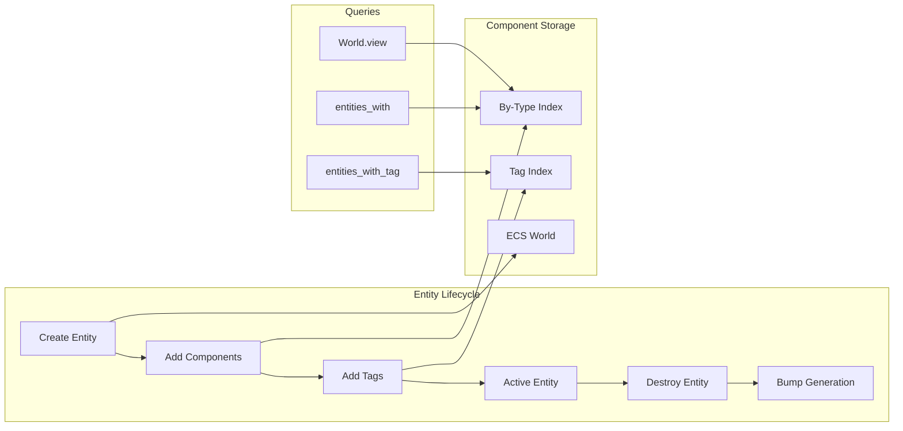

## Event Bus Flow

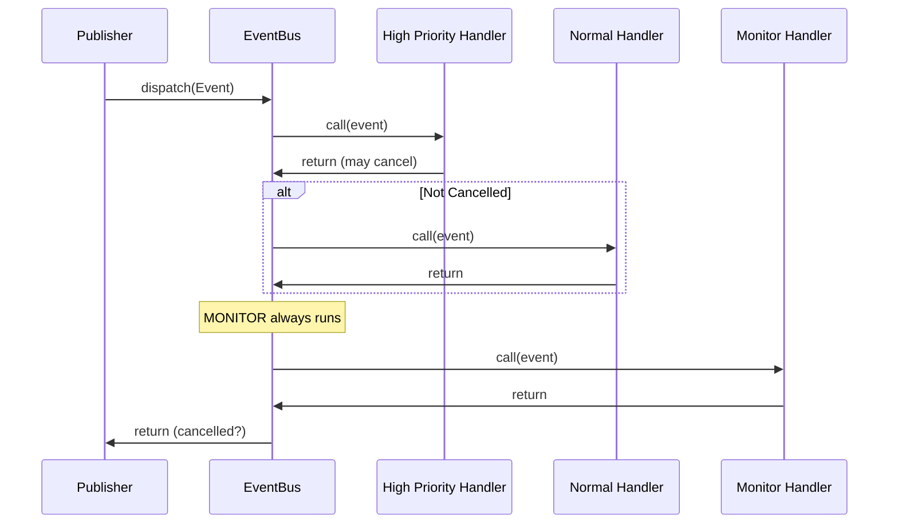

## Plugin Lifecycle

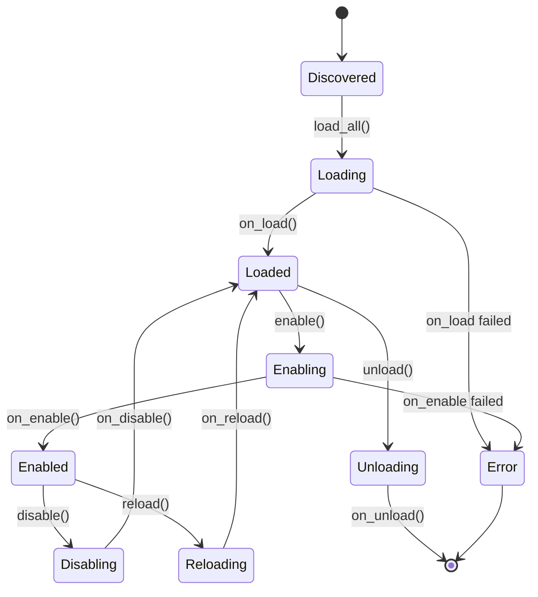

## Combat Resolution

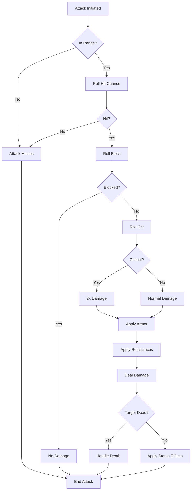

## World Generation Pipeline

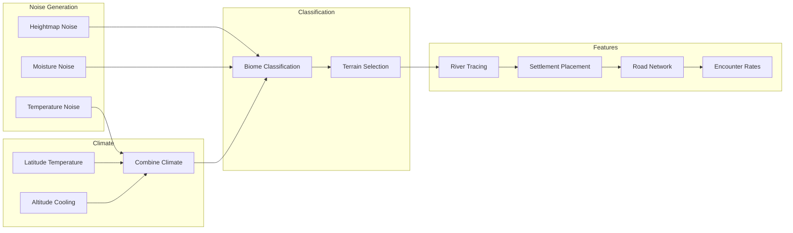

## NPC AI Decision Flow

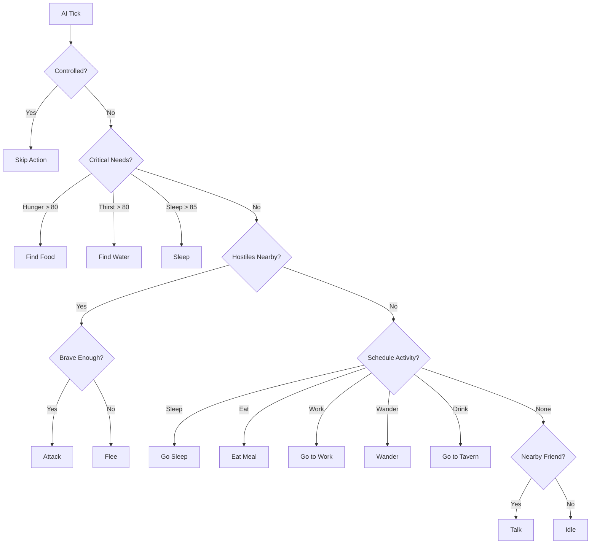

## Skill Progression

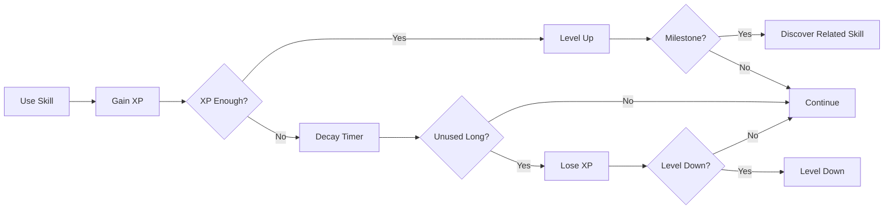

## Save System Architecture

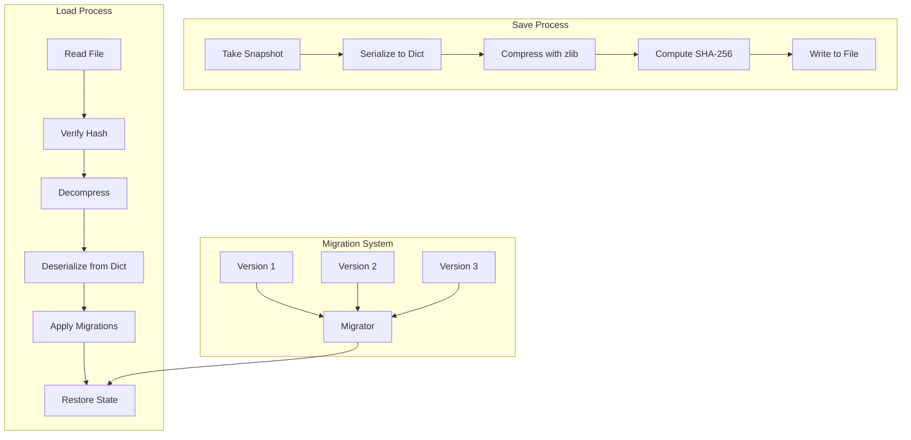

## Networking Architecture

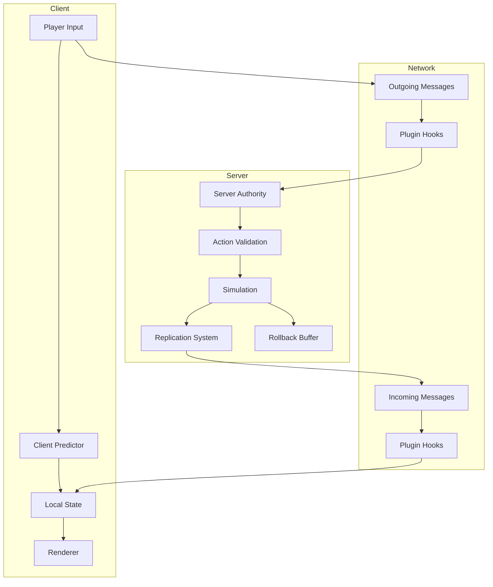

## Streaming World

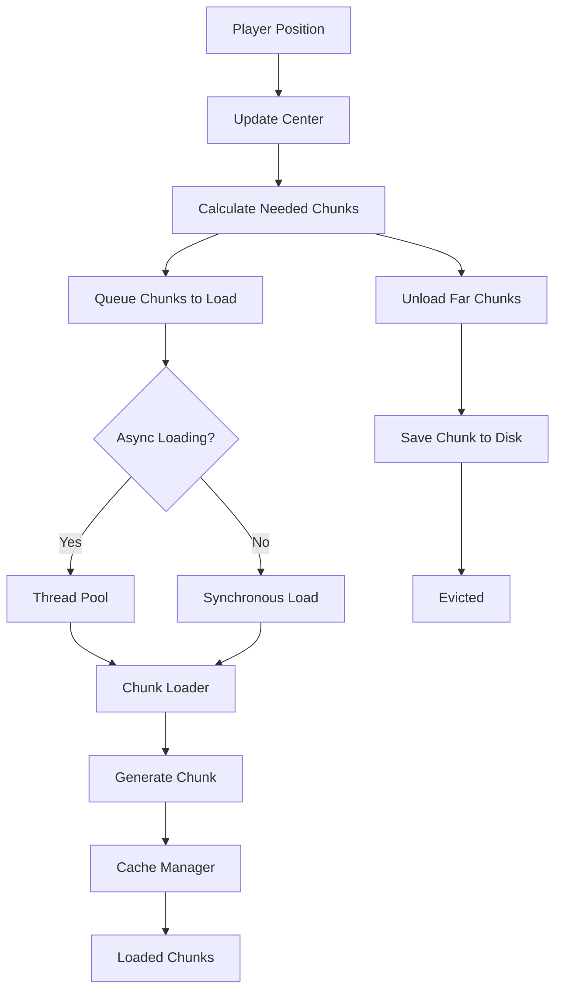

## Dimensional Travel

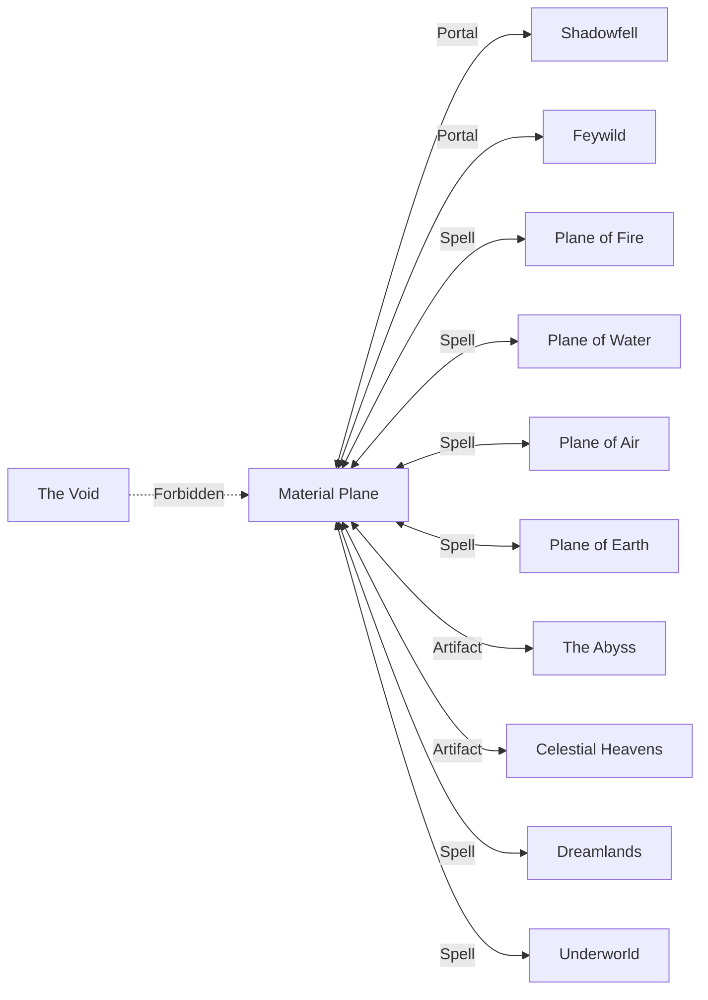

## Quest Chain with Consequences

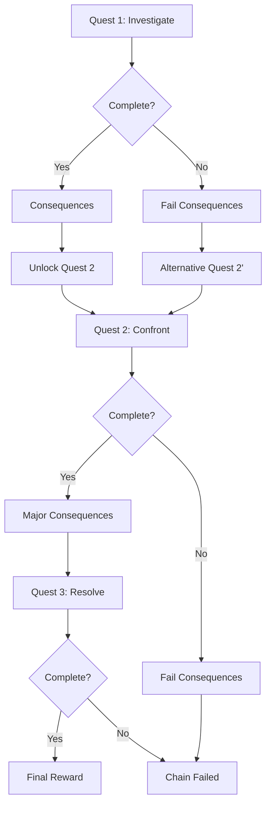

## Background Simulation

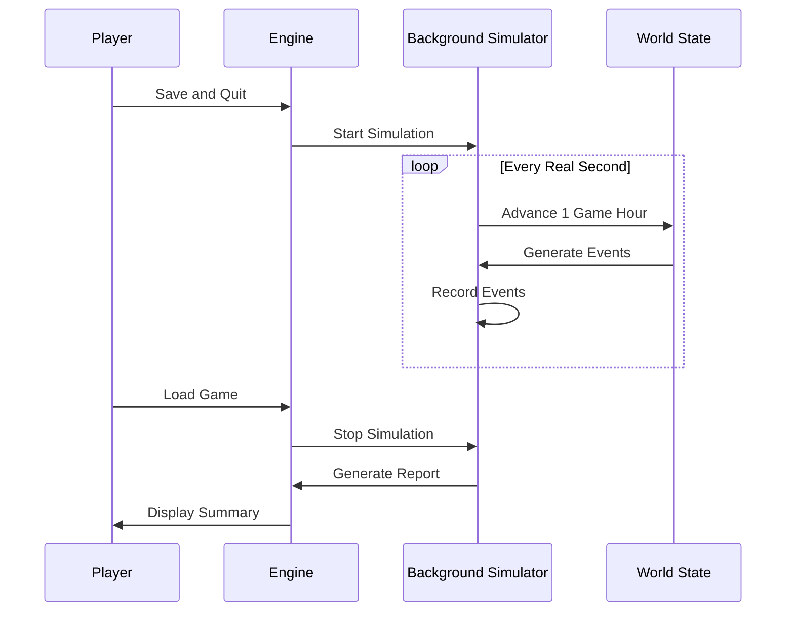

## Replication Flow

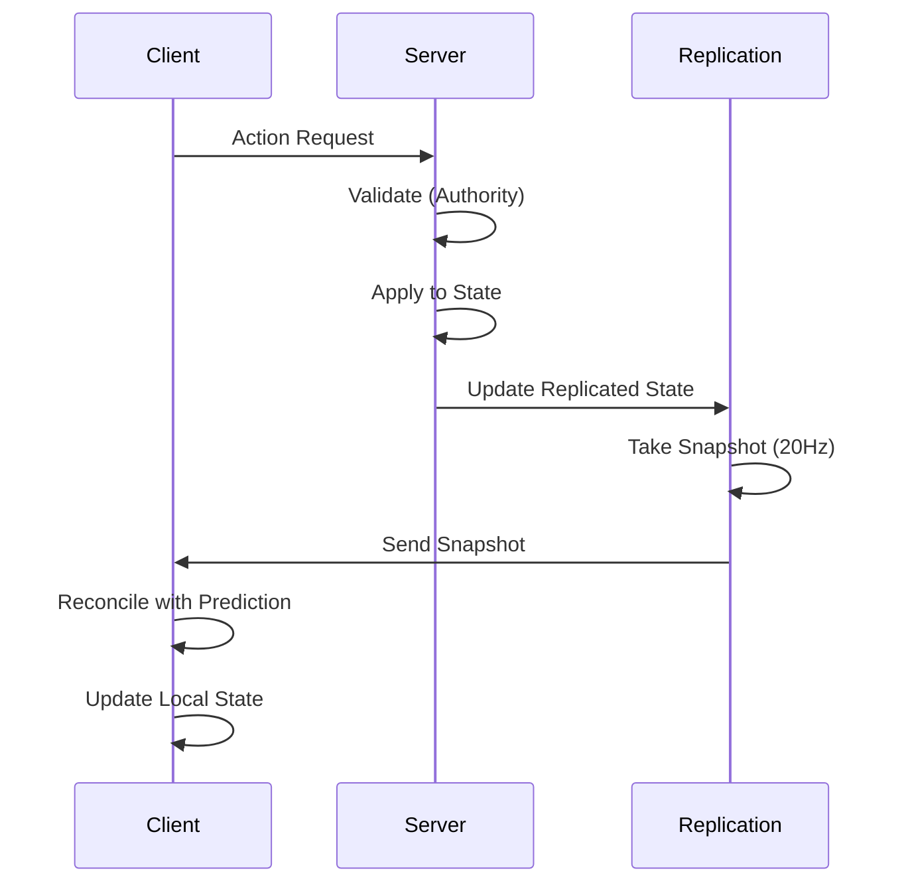

## Content Pack Loading

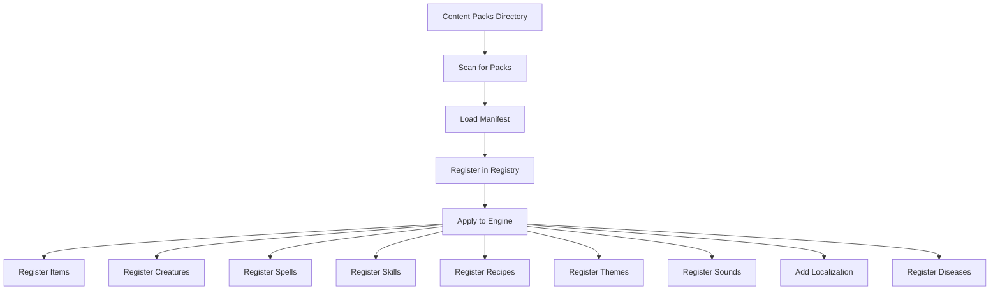
